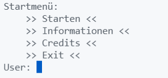
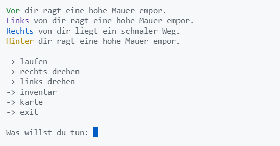
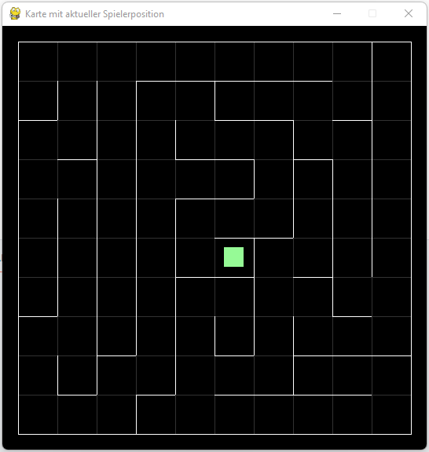

## Einführung
In diesem Projekt soll ein textbasiertes Spiel programmiert werden, bei dem sich der Spieler in einem Irrgarten befindet. 
Ziel ist es aus dem Irrgarten zu entkommen. 
 
Inspiration findet dieses Projekt in dem Roman Maze Runner 1 von James Dashner.
 
 
**Unterschied von Irrgarten und Labyrinth:** 
Ein Labyrinth besitzt keine Verzweigungen, es gibt also nur ein Weg, dem muss man nur folgen und darf nicht die Richtung ändern. 
Ein Irrgarten hat auch Abzweige mit Sackgassen.

---

## Aktuelle Features
Das Spiel startet in dem Startmenü, welches so aussieht: 
</img>
 

Im Spiel sieht die Konsolenausgabe etwa so aus: 
</img>
 
Der Spieler hat eine Richtung in die er schaut. So muss man die Spielfigur erst drehen und dann vorwärts bewegen. 
Dadurch soll der Verwirrungsfaktor erhöht werden. 
Um trotzdem noch einen groben Überblick zu haben, besitzt der Spieler eine Karte:
</img>
 
Somit kann er grob einschätzen wo er sich befindet. 
 
 
Der Text im Spiel soll sich analog anfühlen (wie eine sehr alte Tastatur aus den 2000ern) und deswegen werden die Buchstaben einzelnt mit Sound ausgegeben (die Geschwindigkeit eines Buchstaben und der Sound werden zufallsgeneriert ausgegeben). 
Folgendes Beispiel soll dies zeigen: 
<video controls>
  <source src="img/startmenu_show.mp4" type="video/mp4">
</video> 

https://user-images.githubusercontent.com/50902823/151681710-8e6df612-df74-4b8a-a7d5-643682a2e661.mp4

---

## Pläne für die Zukunft
Dieses Projekt hat aktuell nur seine Grundlagen erreicht und im Folgenden werden Features aufgezählt, welche ich gerne noch implementieren würde. 
 

- Einführung von Gegnern, Items und Kampfsystem
- Dokumente über mehr Lore -> Informationen (von Spieler findbar)
- Ausrüstung, Magie, Skills
- Mehrere Level
- Boss-Gegner
- Kampfsystem Überarbeitung -> Minispiele gegen KI (?)
- Survival Elemente
- Zeit (Tag/Nacht)
- Speichern/Laden von Spielständen
- Basis
- Discord Plug-In
